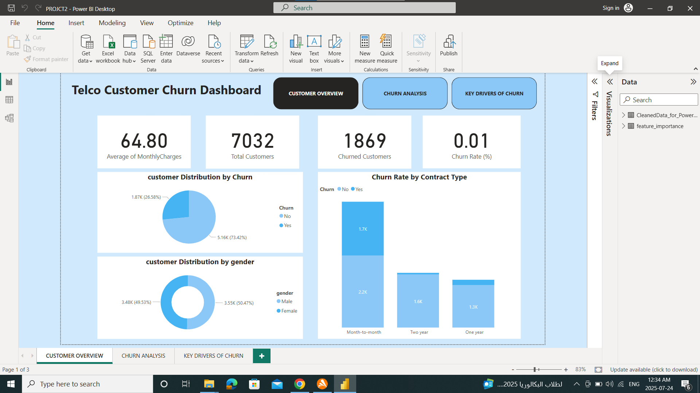
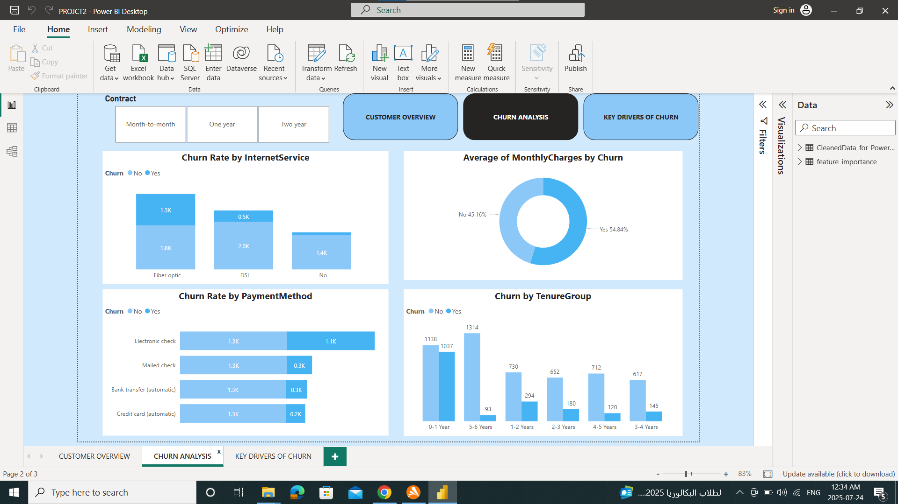
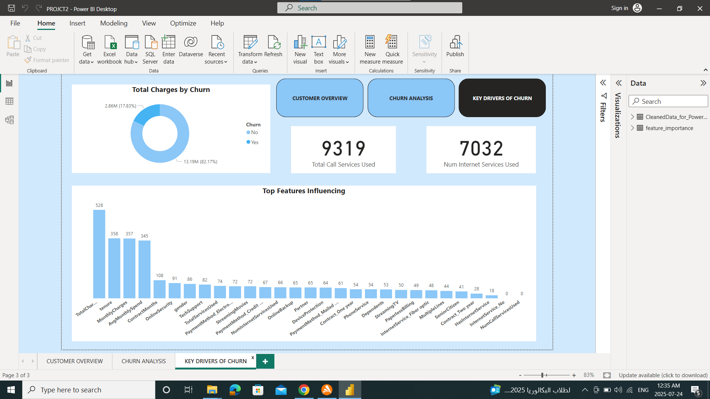

# 📊 Telco Customer Churn Analysis

## 🚀 Overview
Customer churn is a critical challenge in the telecommunications industry, directly impacting revenue and growth.  
This project analyzes customer behavior to uncover the key factors driving churn and provides actionable insights to improve retention.

---

## 🎯 Business Objective
- Identify the main drivers of customer churn  
- Segment high-risk customers  
- Support data-driven decision-making to reduce churn rate  

---

## 📂 Project Workflow
1. **Data Cleaning & Preprocessing**
   - Handled missing values and data inconsistencies  
   - Converted data types and prepared dataset for analysis  

2. **Exploratory Data Analysis (EDA)**
   - Analyzed customer demographics and service usage  
   - Identified patterns and correlations related to churn  

3. **Data Modeling (Power BI)**
   - Built relationships between tables  
   - Created calculated columns and DAX measures  

4. **Dashboard Development**
   - Designed an interactive dashboard for business users  
   - Focused on usability and clear KPI tracking  

---

## 🛠️ Tools & Technologies
- **Python:** Pandas, NumPy, Matplotlib, Seaborn  
- **Power BI:** Data Modeling, DAX, Visualization  
- **Excel/CSV:** Data source  

---

## 📊 Dashboard Preview

### 🔹 Customer Overview

### 🔹 Churn Analysis

### 🔹 Key Drivers

---

## 🔍 Key Insights
- Customers with **month-to-month contracts** have the highest churn rate  
- **High monthly charges** are strongly associated with churn  
- Customers using **electronic check payments** are more likely to leave  
- The **first year (0–12 months)** is the most critical period  
- Lack of **technical support services** increases churn probability  

---

## 💡 Business Recommendations
- Encourage customers to switch to **long-term contracts** through incentives  
- Focus retention strategies on **new customers (first 12 months)**  
- Improve and promote **technical support services**  
- Shift users toward **automated payment methods**  

---

## 📈 Project Impact
This dashboard enables stakeholders to:
- Quickly identify high-risk customers  
- Monitor churn trends in real time  
- Make data-driven retention decisions  

---

## 🔗 Project Links
- 💼 **LinkedIn Post:**  
  https://www.linkedin.com/posts/shimaa-alaa5_telco-churn-project-activity-7354112279165964289-GgWE

- 💻 **GitHub Profile:**  
  https://github.com/ShimaaAlaaGomaa  

---

## 👩‍💻 Author
**Shimaa Alaa**  
Data Analyst | Business Intelligence Enthusiast  

---
